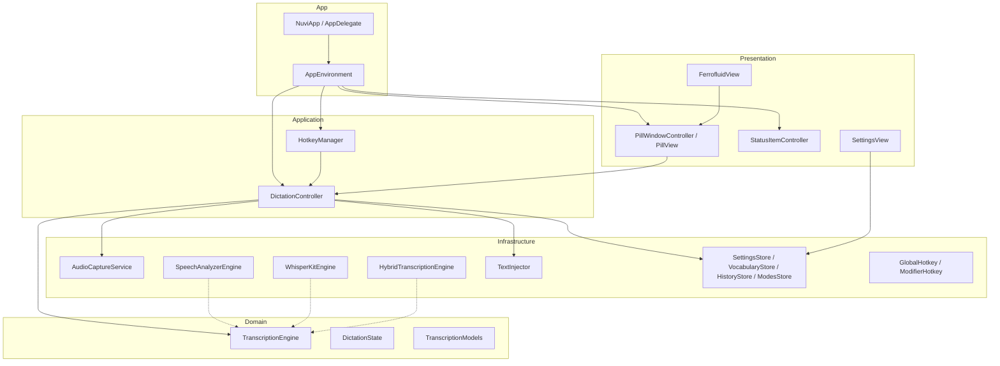

# Documentación Técnica de Nuvi

Documento actualizado y contrastado con el código del repositorio el
**2026-06-16**.

## Resumen ejecutivo

Nuvi es una app nativa de dictado para la barra de menú de macOS. Captura audio
del micrófono, lo transcribe localmente y luego inserta el texto en la app con
foco. La UI está construida con AppKit + SwiftUI y el visualizador usa Metal.

Checks verificados durante esta auditoría:

- `swift build` compila correctamente
- `./scripts/build-app.sh release` genera `build/Nuvi.app`
- `swift test` hoy falla porque **no existe target de tests**

## Plataforma real del proyecto

- **Swift tools**: 6.0
- **Modo de lenguaje del target**: Swift 5 (`swiftSettings: [.swiftLanguageMode(.v5)]`)
- **Sistema mínimo**: macOS **26.0**
- **Estilo de app**: agente de barra de menú (`LSUIElement = true`)

Importante: una versión anterior de esta documentación decía macOS 15+, pero el
proyecto real declara macOS 26.0 tanto en `Package.swift` como en
`Resources/Info.plist`.

## Arquitectura real

El diseño general sigue una intención hexagonal, pero con un matiz importante:
el puerto claro hoy es **`TranscriptionEngine`**. No todo lo demás está modelado
como puertos todavía.

## Capas y archivos importantes

### Dominio (`Sources/Nuvi/Domain/Dictation`)

- **`TranscriptionEngine.swift`**: puerto principal del sistema de dictado
- **`TranscriptionModels.swift`**: `TranscriptionEvent` y `TranscriptionError`
- **`DictationState.swift`**: estados del flujo de dictado

Corrección importante: antes se mencionaba un archivo
`TranscriptionEvent.swift`, pero el archivo real es `TranscriptionModels.swift`.

### Aplicación (`Sources/Nuvi/Application`)

- **`DictationController.swift`**: orquesta permiso de micrófono, captura,
  transcripción, post-procesamiento e inserción
- **`HotkeyManager.swift`**: reconstruye y registra shortcuts en caliente

### Infraestructura (`Sources/Nuvi/Infrastructure`)

- **`Audio/AudioCaptureService.swift`**: servicio concreto de captura con
  `AVAudioEngine`
- **`Speech/SpeechAnalyzerEngine.swift`**: adapter nativo Apple Speech
- **`Speech/WhisperKitEngine.swift`**: adapter WhisperKit
- **`Speech/HybridTranscriptionEngine.swift`**: composite SpeechAnalyzer →
  WhisperKit
- **`Speech/TranscriptionEngineFactory.swift`**: punto único de selección de motor
- **`Output/TextInjector.swift`**: inserta por Accessibility o deja el texto en
  el portapapeles
- **`Settings/SettingsStore.swift`**: preferencias mínimas
- **`Settings/VocabularyStore.swift`**: reemplazos de vocabulario
- **`Settings/HistoryStore.swift`**: persistencia de historial
- **`Modes/ModesStore.swift`**: modos de post-procesamiento
- **`Hotkey/GlobalHotkey.swift`** y **`Hotkey/ModifierHotkey.swift`**: shortcuts
  globales

### Presentación (`Sources/Nuvi/Presentation`)

- **`Pill/`**: ventana flotante y contenido de la píldora
- **`Ferrofluid/`**: renderer Metal y bridge SwiftUI
- **`MenuBar/StatusItemController.swift`**: icono y menú en barra de menú
- **`Settings/SettingsView.swift`**: paneles de configuración

## Flujo de ejecución real

1. `NuviApp` crea `AppEnvironment`
2. `AppEnvironment` compone dependencias y arranca shortcuts + menu bar
3. El usuario dispara un shortcut o el menú
4. `DictationController`:
   - pide permiso de micrófono
   - inicia `AudioCaptureService`
   - prepara el motor configurado
   - consume eventos de transcripción
   - aplica modo activo + vocabulario
   - inserta texto vía `TextInjector`
   - persiste historial

## Motores de transcripción

El proyecto expone estas preferencias:

- **`speechAnalyzer`**: valor por defecto actual
- **`auto`**: híbrido SpeechAnalyzer → WhisperKit
- **`whisperKit`**: WhisperKit directo

Corrección importante: una versión anterior de la documentación decía que
`auto` era el default. El código actual en `SettingsStore` usa
**`speechAnalyzer`** por defecto.

## Permisos

- **Micrófono**: obligatorio para capturar audio
- **Accesibilidad**: obligatoria para pegar texto en la app con foco

Si Accesibilidad no está concedida, `TextInjector` deja el resultado en el
portapapeles y no intenta pegarlo.

## Códigos de error

Todo fallo se mapea a un `NuviError` con un código estable
(`Sources/Nuvi/Domain/Dictation/NuviError.swift`). El código se muestra en la
píldora (`… (NUVI-T04)`) y se registra en el log como
`Nuvi/error [NUVI-T04]: …` o `Nuvi/notice [NUVI-T05]: …`. No hay fallos
silenciosos: incluso "no se dijo nada" emite un aviso con código.

| Código | Significado |
|--------|-------------|
| `NUVI-A01` | Permiso de micrófono denegado |
| `NUVI-A02` | Micrófono en uso por otra app |
| `NUVI-A03` | Micrófono no disponible |
| `NUVI-A04` | No se pudo iniciar la captura |
| `NUVI-A05` | No llegó audio del micrófono (mic mudo/desconectado) |
| `NUVI-T01` | Idioma no soportado |
| `NUVI-T02` | Motor de transcripción no disponible |
| `NUVI-T03` | Modelo de voz no instalado |
| `NUVI-T04` | Reconocimiento de voz no autorizado |
| `NUVI-T05` | No se detectó habla (aviso, no error) |
| `NUVI-T06` | Fallo interno del motor |
| `NUVI-O01` | Texto dejado en portapapeles (sin campo con foco) |
| `NUVI-X01` | Error inesperado (sin clasificar) |

Para leer los códigos en vivo: lanzá la app con `open` y en otra terminal
`log stream --predicate 'process == "Nuvi"' --info --debug`.

## Estado actual de calidad

### Verificado

- El proyecto compila
- El bundle se empaqueta correctamente
- Hay separación razonable entre dominio, adapters y presentación
- Existe un modo headless `--probe` para validar motores en una máquina real

### Pendiente

- No hay suite automatizada de tests
- Faltan pruebas runtime para confirmar algunos riesgos de concurrencia
- La documentación histórica tenía drift respecto del código y fue corregida en
  esta auditoría
