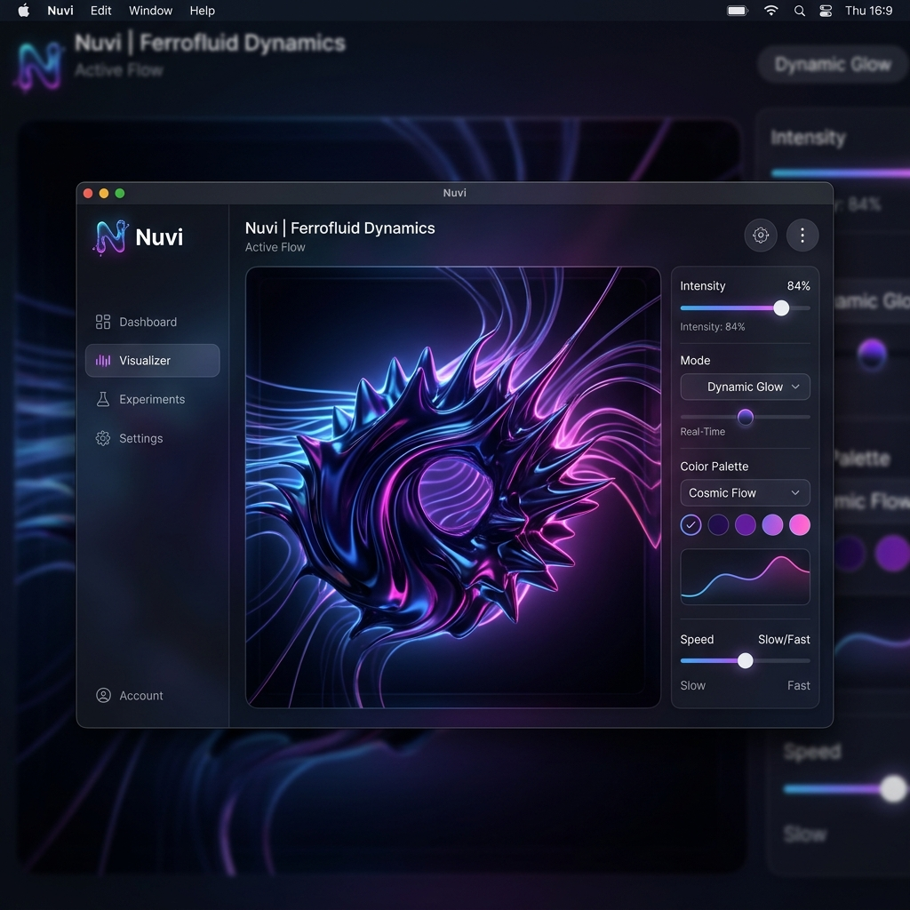

# Nuvi

<p align="center">
  
</p>

Nuvi is a native macOS menu-bar dictation app featuring a floating pill, a Metal-based ferrofluid visualizer, global hotkeys, and on-device speech-to-text transcription that automatically inserts text into the focused application.

Built purely in Swift, AppKit, SwiftUI, AVFoundation, and Metal. No Electron. No Python runtime dependencies.

## Verified status

Verified in this repository on **2026-06-16**:

- `swift build` ✅
- `./scripts/build-app.sh release` ✅
- `swift test` ✅ 5 regression tests

Important: the repo currently documents some historical engine claims, but it
does **not** include benchmark artifacts that prove relative WER/speed numbers.
This README keeps only what is verifiable from the codebase.

## Runtime target

- **Minimum OS**: macOS **26.0** (`Package.swift` and `Resources/Info.plist`)
- **Architecture**: Apple Silicon
- **App style**: menu-bar agent (`LSUIElement` / `.accessory`)

## Current engine behavior

Nuvi exposes three engine preferences:

- **`speechAnalyzer`** — current default in `SettingsStore`
- **`auto`** — `HybridTranscriptionEngine` (SpeechAnalyzer primary, WhisperKit fallback)
- **`whisperKit`** — direct WhisperKit selection

This matters because older docs in the repo incorrectly said that `auto` was
the default. It is **not** the default right now; `speechAnalyzer` is.

## Architecture

```text
Sources/Nuvi/
├── App/
│   ├── NuviApp.swift
│   ├── AppEnvironment.swift
│   └── Probe.swift
├── Application/
│   ├── DictationController.swift
│   └── HotkeyManager.swift
├── Domain/Dictation/
│   ├── DictationState.swift
│   ├── TranscriptionEngine.swift
│   └── TranscriptionModels.swift
├── Infrastructure/
│   ├── Audio/
│   ├── Hotkey/
│   ├── Modes/
│   ├── Output/
│   ├── Settings/
│   └── Speech/
└── Presentation/
    ├── Ferrofluid/
    ├── MenuBar/
    ├── Pill/
    └── Settings/
```

Design intent is hexagonal around the transcription port:

- `TranscriptionEngine` is the main domain port.
- `SpeechAnalyzerEngine`, `WhisperKitEngine`, and `HybridTranscriptionEngine`
  are adapters.
- `DictationController` orchestrates microphone → engine → post-processing →
  insertion.

One correction versus older docs: `AudioCaptureService` is currently a
**concrete infrastructure service**, not a domain port.

## Build and run

```bash
./scripts/build-app.sh release
open build/Nuvi.app
```

What the script does:

1. Runs `swift build -c release`
2. Assembles `build/Nuvi.app`
3. Signs the bundle ad-hoc unless `NUVI_SIGN_IDENTITY` is provided

## First-run permissions

Grant in **System Settings → Privacy & Security**:

- **Microphone** — required to capture speech
- **Accessibility** — required to paste into the focused app

Without Accessibility, Nuvi falls back to **clipboard-only** insertion.

## Usage

- **⌥ Space** — toggle dictation (default, user-rebindable)
- **Push to Talk** — optional hold-to-record shortcut
- **⌥⇧K** — cycle mode (default, user-rebindable)
- **Esc** — cancel active recording

Shortcuts are configured in **Settings → Configuration → Keyboard Shortcuts**.

## Implemented features

- Floating pill (`NSPanel`) that stays out of the way of the focused app
- Live ferrofluid visualizer rendered with Metal
- Menu-bar control surface
- SpeechAnalyzer adapter
- WhisperKit adapter
- Hybrid engine adapter
- Vocabulary replacement rules
- History persistence
- Modes with formatting / affixes / optional auto-activation by frontmost app
- Launch-at-login toggle
- Shortcut recording, including modifier-only push-to-talk
- Headless probe mode (`Nuvi --probe <audio-file> [locale]`)

## Known gaps

- Test coverage is still small; the initial regression suite covers vocabulary,
  mode resolution, retry after engine errors, and cancel-without-delivery
- WhisperKit currently transcribes in batch after recording stops; it does not
  stream partials
- SpeechAnalyzer probe results are machine/asset dependent

## Engine verification workflow

The repo includes a headless probe mode so you can verify engine behavior on a
real machine without using the UI:

```bash
say -o /tmp/t.aiff "hola, esto es una prueba de dictado"
"$(swift build -c release --show-bin-path)/Nuvi" --probe /tmp/t.aiff es-ES
```

That command is the correct verification path, but its output is machine- and
asset-dependent, so this README does not hardcode a claimed result anymore.
