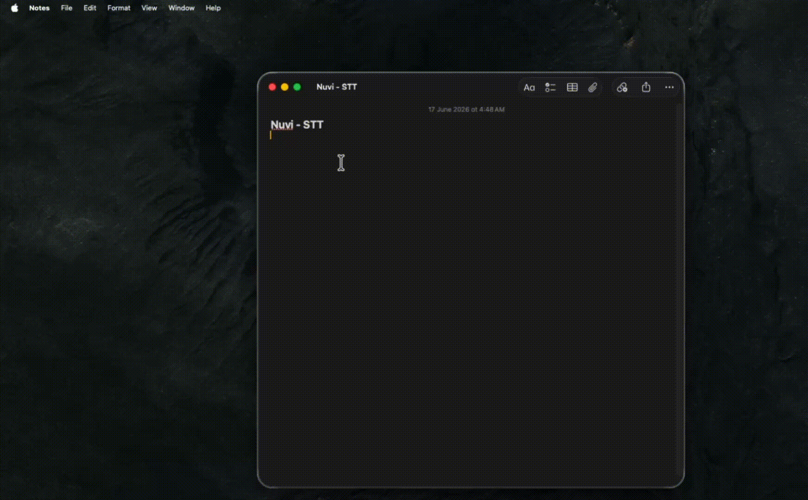

# Nuvi

<p align="center">
  
</p>

Nuvi is a native macOS menu-bar dictation app featuring a floating pill, a Metal-based ferrofluid visualizer, global hotkeys, and on-device speech-to-text transcription that automatically inserts text into the focused application.

Built purely in Swift, AppKit, SwiftUI, AVFoundation, and Metal. No Electron. No Python runtime dependencies.

## Quick Install

You can install Nuvi instantly using Homebrew Cask:

```bash
brew tap ForLess01/tap
brew install --cask nuvi
```

> [!NOTE]
> **Transcription Models**: Speech-to-text models (such as Apple's native on-device speech models or WhisperKit's CoreML models) are **not** bundled with the app download to keep the size small. They are loaded or downloaded automatically in the background on the first run, meaning no manual setup is required.

## Demo

<p align="center">
  
</p>

## Verified status

Verified in this repository on **2026-06-16**:

- `swift build` ✅
- `./scripts/build-app.sh release` ✅
- `swift test` ✅ 5 regression tests

Important: the repo currently documents some historical engine claims, but it
does **not** include benchmark artifacts that prove relative WER/speed numbers.
This README keeps only what is verifiable from the codebase.

## Runtime target

- **Minimum OS**: macOS **26.0** (`Package.swift` and `Resources/Info.plist`)
- **Architecture**: Apple Silicon
- **App style**: menu-bar agent (`LSUIElement` / `.accessory`)

## Current engine behavior

Nuvi exposes three engine preferences:

- **`speechAnalyzer`** — current default in `SettingsStore`
- **`auto`** — `HybridTranscriptionEngine` (SpeechAnalyzer primary, WhisperKit fallback)
- **`whisperKit`** — direct WhisperKit selection

This matters because older docs in the repo incorrectly said that `auto` was
the default. It is **not** the default right now; `speechAnalyzer` is.

## Models and offline dictation

Transcription models are **not** bundled directly inside the Git repository to keep the download size lightweight. Instead, Nuvi manages and downloads models dynamically:

### 1. `speechAnalyzer` (Apple Speech Engine)
Uses Apple's native `SFSpeechRecognizer` framework.
* **macOS Compatibility**:
  - **Requisitos**: Disponible a partir de macOS 10.15 (Catalina).
  - **On-Device (Offline)**: Para que el reconocimiento sea 100% local, privado y sin conexión a internet, se requiere **Apple Silicon (M1/M2/M3/M4/etc.)** o macOS 12 (Monterey) en adelante con soporte de dictado local activado.
* **Modelos**: Utiliza los modelos de redes neuronales propietarios de Apple (Siri/Dictation) integrados y optimizados directamente en macOS.
* **Idiomas y Configuración**:
  1. Abrí **System Settings (Ajustes del Sistema) → Keyboard (Teclado) → Dictation (Dictado)**.
  2. Activá el Dictado y seleccioná los idiomas que quieras utilizar. Asegurate de que se descarguen localmente para usarlos sin internet.

### 2. `whisperKit` / `auto` (Whisper Engine)
Utiliza el framework de código abierto `WhisperKit` de Argmax, ejecutando modelos Whisper de OpenAI optimizados para CoreML (Apple Neural Engine).
* **macOS Compatibility**:
  - **Requisitos**: macOS 14.0 (Sonoma) o superior. Altamente recomendado para procesadores Apple Silicon para aprovechar la aceleración por hardware del Neural Engine (ANE).
* **Modelos Soportados**:
  - **Predeterminado**: `openai_whisper-tiny` (Transcribe muy rápido con un uso de memoria extremadamente bajo, ~75MB).
  - **Compatibilidad**: Es compatible con cualquier variante de Whisper oficial de OpenAI optimizada para CoreML por Argmax en formato de 16-bits (Float16) y 8-bits (cuantizado para ANE):
    - `openai_whisper-tiny` / `openai_whisper-tiny.en`
    - `openai_whisper-base` / `openai_whisper-base.en`
    - `openai_whisper-small` / `openai_whisper-small.en`
    - `openai_whisper-medium` / `openai_whisper-medium.en`
    - `openai_whisper-large-v2`
    - `openai_whisper-large-v3` / `openai_whisper-large-v3-turbo`
* **Instalación y Cache**:
  - Los modelos se descargan de Hugging Face automáticamente la primera vez que se realiza una transcripción o cuando los seleccionás en la sección **Models library** de los Ajustes.
  - Se guardan localmente en:
    `~/Library/Application Support/com.nuvi.app/WhisperKit/`
  - *No se requiere ninguna acción manual de consola para descargarlos.*

---

## Architecture

```text
Sources/Nuvi/
├── App/
│   ├── NuviApp.swift
│   ├── AppEnvironment.swift
│   └── Probe.swift
├── Application/
│   ├── DictationController.swift
│   └── HotkeyManager.swift
├── Domain/Dictation/
│   ├── DictationState.swift
│   ├── TranscriptionEngine.swift
│   └── TranscriptionModels.swift
├── Infrastructure/
│   ├── Audio/
│   ├── Hotkey/
│   ├── Modes/
│   ├── Output/
│   ├── Settings/
│   └── Speech/
└── Presentation/
    ├── Ferrofluid/
    ├── MenuBar/
    ├── Pill/
    └── Settings/
```

Design intent is hexagonal around the transcription port:

- `TranscriptionEngine` is the main domain port.
- `SpeechAnalyzerEngine`, `WhisperKitEngine`, and `HybridTranscriptionEngine`
  are adapters.
- `DictationController` orchestrates microphone → engine → post-processing →
  insertion.

One correction versus older docs: `AudioCaptureService` is currently a
**concrete infrastructure service**, not a domain port.

## Installation and Setup

### 1. Build and Install

Nuvi is compiled directly from the source code. Follow these simple steps to install it:

1. Clone this repository to your local machine:
   ```bash
   git clone git@github.com:ForLess01/Nuvi_STT.git
   cd Nuvi_STT
   ```
2. Build the production app bundle using the release script:
   ```bash
   ./scripts/build-app.sh release
   ```
3. Open the compiled application:
   ```bash
   open build/Nuvi.app
   ```
   *Tip: You can drag and drop `Nuvi.app` from the `build` folder into your `/Applications` directory to install it permanently.*

---

### 2. macOS System Permissions

Since Nuvi runs as a menu-bar agent that captures audio and automatically types the transcribed text for you, macOS requires the following permissions to be granted on its first launch:

- **Microphone (Micrófono)**:
  - **Why**: Required to capture your voice input for transcription.
  - **How to grant**: Go to **System Settings (Ajustes del Sistema) → Privacy & Security (Privacidad y Seguridad) → Microphone (Micrófono)** and toggle the switch on for **Nuvi**.
  
- **Accessibility (Accesibilidad)**:
  - **Why**: Required to automatically inject and paste the transcribed text directly at the cursor location of whichever app you are currently using.
  - **How to grant**: Go to **System Settings (Ajustes del Sistema) → Privacy & Security (Privacidad y Seguridad) → Accessibility (Accesibilidad)** and add/enable **Nuvi** in the allowed applications list.
  
> [!NOTE]
> If you do not grant **Accessibility** permissions, Nuvi will fallback to copying the transcribed text to your **Clipboard** so you can paste it manually.

## Usage

- **⌥ Space** — toggle dictation (default, user-rebindable)
- **Push to Talk** — optional hold-to-record shortcut
- **⌥⇧K** — cycle mode (default, user-rebindable)
- **Esc** — cancel active recording

Shortcuts are configured in **Settings → Configuration → Keyboard Shortcuts**.

## Implemented features

- Floating pill (`NSPanel`) that stays out of the way of the focused app
- Live ferrofluid visualizer rendered with Metal
- Menu-bar control surface
- SpeechAnalyzer adapter
- WhisperKit adapter
- Hybrid engine adapter
- Vocabulary replacement rules
- History persistence
- Modes with formatting / affixes / optional auto-activation by frontmost app
- Launch-at-login toggle
- Shortcut recording, including modifier-only push-to-talk
- Headless probe mode (`Nuvi --probe <audio-file> [locale]`)

## Known gaps

- Test coverage is still small; the initial regression suite covers vocabulary,
  mode resolution, retry after engine errors, and cancel-without-delivery
- WhisperKit currently transcribes in batch after recording stops; it does not
  stream partials
- SpeechAnalyzer probe results are machine/asset dependent

## Engine verification workflow

The repo includes a headless probe mode so you can verify engine behavior on a
real machine without using the UI:

```bash
say -o /tmp/t.aiff "hola, esto es una prueba de dictado"
"$(swift build -c release --show-bin-path)/Nuvi" --probe /tmp/t.aiff es-ES
```

That command is the correct verification path, but its output is machine- and
asset-dependent, so this README does not hardcode a claimed result anymore.
