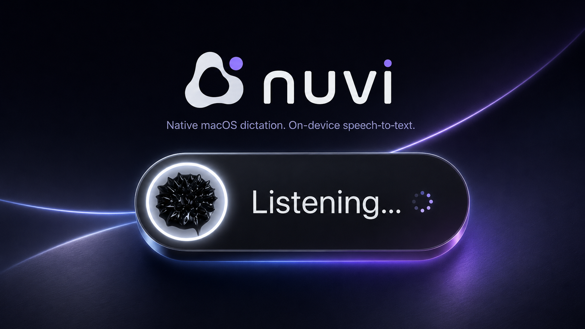
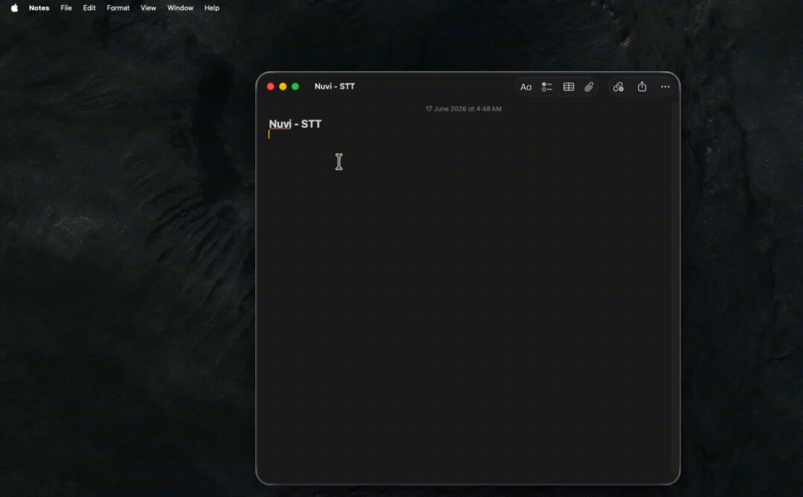

# Nuvi

<p align="center">
  
</p>

Nuvi is a native macOS menu-bar dictation app featuring a floating pill, a Metal-based ferrofluid visualizer, global hotkeys, and on-device speech-to-text transcription that automatically inserts text into the focused application.

Built purely in Swift, AppKit, SwiftUI, AVFoundation, and Metal. No Electron. No Python runtime dependencies.

## What's new in v2.1

- **LIVE dictation (Beta)** — progressively inserts speech into the focused editable field while preserving committed text across pauses and partial revisions.
- **Automatic translation (Beta)** — detects the spoken language and delivers the original text, English (US), English (UK), or Portuguese (Brazil) through Apple's on-device Translation framework.
- **Recent Transcriptions** — quickly recover, copy, or insert recent results from the menu bar.
- **Safer text insertion** — avoids leaking placeholder or suggestion text, verifies successful delivery, and reports **Inserted** or **Copied** instead of echoing private transcript content in the pill.
- **A quieter interface** — independently hide the floating pill or active menu-bar status text while keeping dictation and Escape-to-cancel available.
- **New Nuvi identity** — official isologo, app icon, menu-bar mark, Soft White / Charcoal / Lavender palette, and refreshed community cover.
- **Reliability** — single-instance launch protection and broader engine, LIVE, translation, history, and insertion regression coverage.

<p align="center">
  
</p>

See the complete [Nuvi v2.1.0 release notes](docs/releases/v2.1.0.md).

## Quick Install

You can install Nuvi instantly using Homebrew Cask:

```bash
brew tap ForLess01/tap
brew install --cask nuvi
```

> [!NOTE]
> **Transcription Models**: Speech-to-text models (such as Apple's native on-device speech models or WhisperKit's CoreML models) are **not** bundled with the app download to keep the size small. They are loaded or downloaded automatically in the background on the first run, meaning no manual setup is required.

## Demo

<p align="center">
  
</p>

## Verified status

Verified in this repository on **2026-08-14**:

- `swift test` ✅ 117 tests, 0 failures (2 opt-in runtime probes skipped)
- Release bundle ✅ built, signed, installed, and matched byte-for-byte with the
  installed executable during local release verification

Important: the repo currently documents some historical engine claims, but it
does **not** include benchmark artifacts that prove relative WER/speed numbers.
This README keeps only what is verifiable from the codebase.

## Runtime target

- **Minimum OS**: macOS **26.0** (`Package.swift` and `Resources/Info.plist`)
- **Architecture**: Apple Silicon
- **App style**: menu-bar agent (`LSUIElement` / `.accessory`)

## Current engine behavior

Nuvi exposes four engine preferences:

- **`speechAnalyzer`** — current default in `SettingsStore`
- **`auto`** — `HybridTranscriptionEngine` (SpeechAnalyzer primary, WhisperKit fallback)
- **`whisperKit`** — direct WhisperKit selection
- **`parakeet`** — Parakeet TDT via FluidAudio (selected automatically when you activate a Parakeet model in the Models Library)

This matters because older docs in the repo incorrectly said that `auto` was
the default. It is **not** the default right now; `speechAnalyzer` is.
Engine and model changes apply to the next dictation without relaunching Nuvi.
If a setting changes during an active recording, Nuvi finishes or cancels that
session with its original engine and then applies the new configuration.

## Models and offline dictation

Transcription models are **not** bundled directly inside the Git repository to keep the download size lightweight. Instead, Nuvi manages and downloads models dynamically:

### 1. `speechAnalyzer` (Apple speech engine)

The adapter currently uses Apple's `SFSpeechRecognizer` API and requires
on-device recognition. Nuvi itself targets **macOS 26.0**, regardless of the
older OS versions on which parts of the Speech framework first appeared.
Availability still depends on the selected locale and the speech assets present
on the Mac. Enable Dictation and install the desired language in **System
Settings → Keyboard → Dictation** before treating an offline result as verified.

### 2. `whisperKit` / `auto` (Whisper Engine)
Utiliza el framework de código abierto `WhisperKit` de Argmax, ejecutando modelos Whisper de OpenAI optimizados para CoreML (Apple Neural Engine).
* **macOS Compatibility**:
  - **Requisitos**: macOS 14.0 (Sonoma) o superior. Altamente recomendado para procesadores Apple Silicon para aprovechar la aceleración por hardware del Neural Engine (ANE).
* **Modelos Soportados**:
  - **Predeterminado**: `openai_whisper-tiny` (Transcribe muy rápido con un uso de memoria extremadamente bajo, ~75MB).
  - **Compatibilidad**: Es compatible con cualquier variante de Whisper oficial de OpenAI optimizada para CoreML por Argmax en formato de 16-bits (Float16) y 8-bits (cuantizado para ANE):
    - `openai_whisper-tiny` / `openai_whisper-tiny.en`
    - `openai_whisper-base` / `openai_whisper-base.en`
    - `openai_whisper-small` / `openai_whisper-small.en`
    - `openai_whisper-medium` / `openai_whisper-medium.en`
    - `openai_whisper-large-v2`
    - `openai_whisper-large-v3` / `openai_whisper-large-v3-turbo`
* **Instalación y Cache**:
  - Los modelos se descargan de Hugging Face automáticamente la primera vez que se realiza una transcripción o cuando los seleccionás en la sección **Models library** de los Ajustes.
  - Se guardan localmente en:
    `~/Library/Application Support/com.nuvi.app/WhisperKit/`
  - *No se requiere ninguna acción manual de consola para descargarlos.*

### 3. `parakeet` (Parakeet TDT via FluidAudio)
Uses the open-source `FluidAudio` framework running NVIDIA Parakeet TDT 0.6B models compiled for CoreML — very fast on Apple Silicon, with a small RAM footprint (~200MB in use).
* **Modelos Soportados**:
  - **Parakeet TDT v3** — multilingüe (25 idiomas europeos + japonés), ~461 MB en disco.
  - **Parakeet TDT v2** — optimizado para inglés (mayor recall), ~443 MB en disco.
* **Instalación y Cache**:
  - FluidAudio gestiona la descarga; se selecciona desde **Models library** y al activarlo Nuvi cambia el motor a `parakeet` automáticamente.
  - Se guardan en `~/Library/Application Support/FluidAudio/Models/`.

> [!NOTE]
> En **Models library** cada modelo muestra su peso real en disco y un consumo de RAM **referencial** (marcado con `~`). La RAM de Parakeet está medida; la de Whisper es una estimación de pico.

---

## Releasing (free, via Homebrew)

Nuvi is **not notarized** — notarization needs a paid Apple Developer Program
membership, and Nuvi stays free. That's fine for a Homebrew tap; it just means
macOS Gatekeeper flags the app on first launch, which the user clears once.

To cut a release:

1. Build the app bundle and zip it:
   ```bash
   ./scripts/build-app.sh release
   ditto -c -k --sequesterRsrc --keepParent build/Nuvi.app build/Nuvi.zip
   shasum -a 256 build/Nuvi.zip   # note the sha256
   ```
2. Copy `docs/releases/vX.Y.Z.md` into the GitHub release description and
   attach `build/Nuvi.zip` to tag `vX.Y.Z`.
3. Update `version` and `sha256` in `Casks/nuvi.rb` of the `ForLess01/homebrew-tap` repo.

Release notes live in `docs/releases/`; their screenshots and GIFs live in
`docs/assets/releases/vX.Y.Z/`. Keep app/runtime assets in `Resources/` so
release media never becomes part of the packaged app by accident.

### First launch (clearing Gatekeeper, free)

Because the app isn't notarized, after `brew install --cask nuvi` macOS may say
it "cannot be opened". Clear the download quarantine once:

```bash
xattr -dr com.apple.quarantine "/Applications/Nuvi.app"
```

…or right-click **Nuvi.app → Open → Open**. The Homebrew cask prints this hint
automatically after install.

## Architecture

```text
Sources/Nuvi/
├── App/
│   ├── NuviApp.swift
│   ├── AppEnvironment.swift
│   └── Probe.swift
├── Application/
│   ├── DictationController.swift
│   └── HotkeyManager.swift
├── Domain/Dictation/
│   ├── DictationState.swift
│   ├── TranscriptionEngine.swift
│   └── TranscriptionModels.swift
├── Infrastructure/
│   ├── Audio/
│   ├── Hotkey/
│   ├── Modes/
│   ├── Output/
│   ├── Settings/
│   ├── Speech/
│   └── Translation/
└── Presentation/
    ├── Brand/
    ├── Ferrofluid/
    ├── MenuBar/
    ├── Pill/
    └── Settings/
```

Design intent is hexagonal around the transcription port:

- `TranscriptionEngine` is the main domain port.
- `SpeechAnalyzerEngine`, `WhisperKitEngine`, and `HybridTranscriptionEngine`
  are adapters.
- `DictationController` orchestrates microphone → engine → post-processing →
  insertion.

One correction versus older docs: `AudioCaptureService` is currently a
**concrete infrastructure service**, not a domain port.

## Installation and Setup

### 1. Build and install

Nuvi is compiled directly from the source code. Follow these simple steps to install it:

1. Clone this repository to your local machine:
   ```bash
   git clone git@github.com:ForLess01/Nuvi_STT.git
   cd Nuvi_STT
   ```
2. Build the production app bundle without modifying `/Applications`:
   ```bash
   ./scripts/build-app.sh release
   ```
3. Open the compiled application:
   ```bash
   open build/Nuvi.app
   ```
4. To build and replace `/Applications/Nuvi.app` explicitly:
   ```bash
   ./scripts/install-app.sh release
   ```

`build-app.sh` is safe for packaging because it writes SwiftPM artifacts under
`.build/` and the packaged app under `build/`; it never mutates `/Applications`.
`install-app.sh` is the opt-in local installation path.

---

### 2. macOS System Permissions

Since Nuvi runs as a menu-bar agent that captures audio and automatically types the transcribed text for you, macOS requires the following permissions to be granted on its first launch:

- **Microphone (Micrófono)**:
  - **Why**: Required to capture your voice input for transcription.
  - **How to grant**: Go to **System Settings (Ajustes del Sistema) → Privacy & Security (Privacidad y Seguridad) → Microphone (Micrófono)** and toggle the switch on for **Nuvi**.
  
- **Accessibility (Accesibilidad)**:
  - **Why**: Required to automatically inject and paste the transcribed text directly at the cursor location of whichever app you are currently using.
  - **How to grant**: Go to **System Settings (Ajustes del Sistema) → Privacy & Security (Privacidad y Seguridad) → Accessibility (Accesibilidad)** and add/enable **Nuvi** in the allowed applications list.
  
> [!NOTE]
> If you do not grant **Accessibility** permissions, Nuvi will fallback to copying the transcribed text to your **Clipboard** so you can paste it manually.

## Usage

- **⌥ Space** — toggle dictation (default, user-rebindable)
- **Push to Talk** — optional hold-to-record shortcut
- **⌥⇧K** — cycle mode (default, user-rebindable)
- **Esc** — cancel active recording

Shortcuts are configured in **Settings → Configuration → Keyboard Shortcuts**.

## Implemented features

- Floating pill (`NSPanel`) with animated listening, LIVE, inserted, and copied states
- Live ferrofluid visualizer rendered with Metal — color pickers, presets, and a live mic preview
- Official Nuvi app and menu-bar identity with optional active status text
- SpeechAnalyzer adapter
- WhisperKit adapter
- Parakeet (FluidAudio) adapter
- Hybrid engine adapter
- **Models Library** — download / select / delete models for both engines, with real disk sizes and referential RAM
- **English / Spanish interface** with runtime switching
- **LIVE dictation (Beta)** across the current engine adapters
- **Automatic output translation (Beta)** with source-language detection
- **Recent Transcriptions** menu with copy and insertion actions
- Independent pill and menu-bar status visibility controls
- Single-instance launch protection
- Vocabulary replacement rules
- History persistence (opt-out, owner-only file permissions)
- Modes with formatting / affixes / optional auto-activation by frontmost app
- Launch-at-login toggle
- Shortcut recording (full modifier+key combos), including modifier-only push-to-talk
- Headless probe mode (`Nuvi --probe <audio-file> [locale]`)

## Known gaps

- Test coverage includes vocabulary, mode resolution, retry after engine
  errors, cancel-without-delivery, runtime engine/model reconfiguration, pure
  text-injection routing/ghost-text behavior, the models catalog, and the
  ferrofluid shader/uniform layout. Live Accessibility behavior still requires
  manual validation in real target apps.
- LIVE is a Beta workflow and still requires manual Accessibility validation in
  each target app; unsupported or secure fields intentionally fail closed
- Translation availability depends on Apple's supported language pairs and
  locally available language assets
- SpeechAnalyzer probe results are machine/asset dependent
- Model RAM figures are referential: Parakeet is measured, Whisper is estimated

## Engine verification workflow

The repo includes a headless probe mode so you can verify one audio file through
the probe's configured engine path on a real machine without using the UI:

```bash
say -o /tmp/t.aiff "hola, esto es una prueba de dictado"
"$(swift build -c release --show-bin-path)/Nuvi" --probe /tmp/t.aiff es-ES
```

The probe does not replace UI validation, Accessibility insertion testing, or a
full engine/model matrix. Its output is machine- and asset-dependent, so this
README does not hardcode a claimed result.
