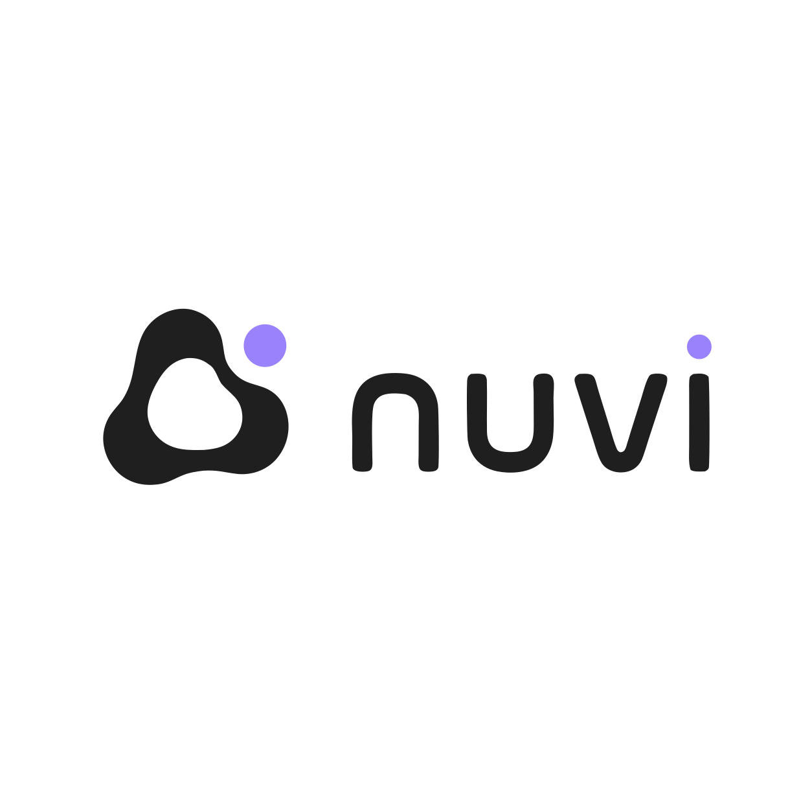
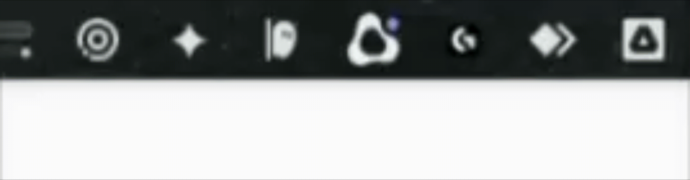

# Nuvi 2.1.0

Nuvi 2.1 is a feature release focused on faster dictation, safer delivery, and
a clearer community identity. Because it adds user-facing capabilities rather
than only correcting defects, it advances the minor version from 2.0.1 to
2.1.0.

<p align="center">
  
</p>

## Highlights

### LIVE dictation (Beta)

LIVE progressively inserts speech into the focused editable field. Nuvi keeps
committed text stable across pauses, treats partial hypotheses as revisions of
only the provisional suffix, and does not report a successful insertion unless
the target can be verified.

### Automatic translation (Beta)

Nuvi can detect the source language and deliver the result as:

- Original
- English (US)
- English (UK)
- Portuguese (Brazil)

Translation uses Apple's on-device Translation framework. Availability depends
on the language pair and language assets installed or offered by macOS.

### Recent Transcriptions

The menu bar now exposes recent results for quick recovery. A result can be
copied to the clipboard or inserted into a valid editable target without
repeating the dictation.

### New Nuvi identity

This release introduces the official Nuvi isologo across the app icon and menu
bar, the Soft White / Charcoal / Lavender palette, rounded system typography,
and a refreshed project cover.

<p align="center">
  
</p>

## Improvements

- The completion pill shows **Inserted** or **Copied** instead of displaying
  the transcription again.
- The transition from Listening to the animated completion check is smoother
  and faster.
- The floating pill and active menu-bar status text can be hidden independently.
- Menu-bar labels and LIVE resource notices follow Nuvi's selected interface
  language immediately.
- Nuvi prevents a second application instance from launching alongside the
  existing process.
- The menu-bar icon remains visible when status text is disabled.

## Fixes

- Prevented AI-editor placeholders and predictive suggestions from leaking
  into inserted transcripts.
- Hardened insertion routing for web, Electron, AppKit, and secure fields.
- LIVE no longer erases already committed text after a speech pause or a
  shorter partial hypothesis.
- LIVE binds to a verified editable target and no longer claims **Inserted**
  when the destination did not accept the text.
- Added progressive decoding paths for the current SpeechAnalyzer, WhisperKit,
  Hybrid, and Parakeet engine configurations.
- Improved handling of cancellation, late engine results, empty speech, model
  reconfiguration, and clipboard fallback.

## Privacy and safety

- Secure fields never use clipboard delivery.
- Completion UI reports the delivery action without exposing transcript text.
- Translation and transcription remain on device; Nuvi does not add a cloud
  translation service.

## Verification

- 117 automated tests passed with 0 failures.
- 2 model-dependent runtime probes remain opt-in and were skipped in the
  standard suite.
- The macOS Release bundle was built, signed, installed, and its installed
  executable matched the built executable during local verification.

## Known limitations

- LIVE and Translation remain **Beta** while the real-app compatibility matrix
  grows.
- Accessibility insertion behavior can vary between target applications and
  must be validated in the actual editor.
- Model-dependent runtime probes require downloaded model assets and are not
  part of the default automated test run.

## Install or upgrade

```bash
brew tap ForLess01/tap
brew update
brew upgrade --cask nuvi
```

For a first installation, use `brew install --cask nuvi` instead of the upgrade
command. See the repository README for the one-time Gatekeeper step required by
the free, non-notarized distribution.
